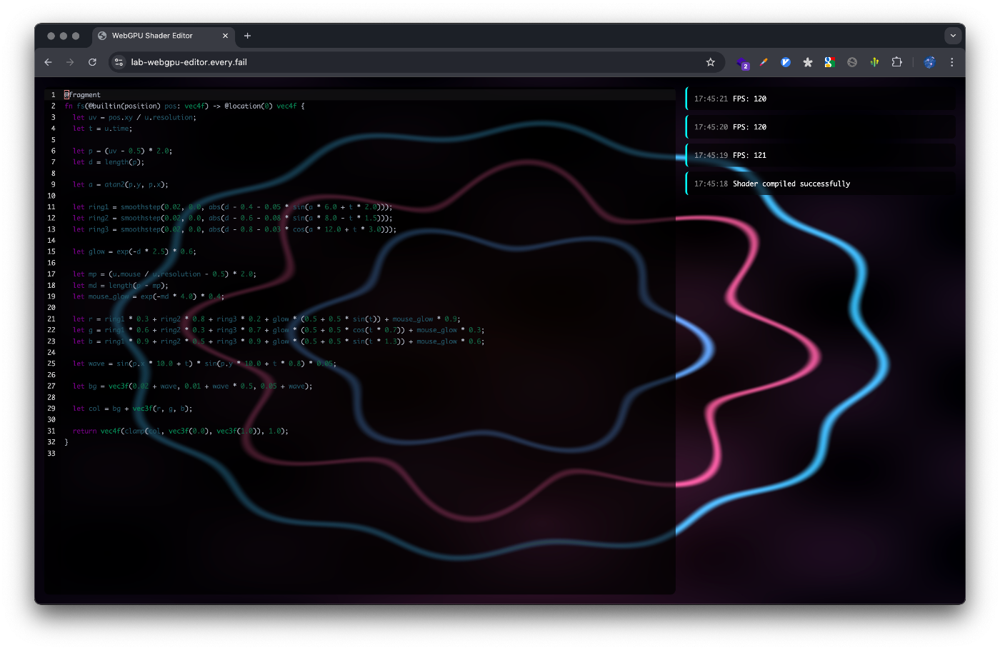

# WebGPU Shader Editor

A real-time WGSL fragment shader editor running entirely in the browser — inspired by Shadertoy, powered by WebGPU and Effect.ts.



## Features

- **Real-time shader editing** — Edit WGSL fragment shaders with instant visual feedback (300ms debounce)
- **Built-in uniforms** — `time`, `resolution`, and `mouse` are available out of the box
- **OffscreenCanvas + Worker** — Rendering runs on a dedicated worker thread, keeping the UI responsive
- **Live log panel** — Compilation results and FPS are displayed in real time
- **CodeMirror 6** — Full-featured editor with WGSL syntax highlighting and One Dark theme

## Tech Stack

| Layer | Technology |
|---|---|
| GPU | [WebGPU](https://www.w3.org/TR/webgpu/) / [WGSL](https://www.w3.org/TR/WGSL/) |
| Concurrency | [Effect](https://effect.website/) (Stream, Queue, Ref, Fiber) |
| Editor | [CodeMirror 6](https://codemirror.net/) + [codemirror-lang-wgsl](https://github.com/iizukak/codemirror-lang-wgsl) |
| Build | [Vite](https://vite.dev/) + TypeScript |

## Architecture

The project follows a layered DDD-style structure with clear separation of concerns:

```
src/
├── domain/           # Pure types — no dependencies
│   ├── messages.ts   # Tagged union messages (MainToWorker / WorkerToMain)
│   ├── shader.ts     # ShaderSource, CompilationResult
│   ├── uniform.ts    # Vector2, Resolution, UniformData
│   └── log.ts        # LogEntry
├── usecases/         # Business logic as Effect Streams
│   ├── shader.ts     # Compile pipeline, worker message handling
│   ├── uniform.ts    # Mouse / resize / animation frame forwarding
│   └── log.ts        # Log state management and rendering
├── infrastructure/   # Side-effectful implementations
│   ├── worker.ts     # GPU worker (OffscreenCanvas rendering loop)
│   ├── gpu-client.ts # Worker initialization from main thread
│   ├── pipeline.ts   # WebGPU pipeline & uniform buffer creation
│   ├── editor.ts     # CodeMirror setup
│   ├── events.ts     # DOM event streams (mouse, resize, animation frame)
│   ├── theme.ts      # Editor theme (transparent + One Dark)
│   ├── log-cards.ts  # Log card DOM rendering
│   ├── vertex.wgsl   # Full-screen triangle vertex shader
│   ├── uniform.wgsl  # Uniform struct declaration
│   └── default.wgsl  # Default fragment shader
└── main.ts           # Composition root — wires everything together
```

### Key Design Decisions

**Thread separation** — The main thread handles only UI (editor + log panel). All WebGPU rendering happens in a Web Worker via `OffscreenCanvas`, so heavy shader compilation never blocks user input.

**Effect as the backbone** — Instead of ad-hoc event listeners, all async flows are modeled as `Stream`s. Multiple streams run concurrently as independent Fibers, communicating through `Queue` and `Ref`. Dependency injection is handled via `Context.Tag` + `Layer`.

**Type-safe messaging** — `Data.TaggedEnum` provides exhaustive pattern matching (`Match.exhaustive`) for all messages between the main thread and the worker.

## Shader Uniforms

The following uniforms are automatically provided to your fragment shader:

```wgsl
struct Uniforms {
  time: f32,
  resolution: vec2f,
  mouse: vec2f,
}

@group(0) @binding(0) var<uniform> u: Uniforms;
```

| Uniform | Description |
|---|---|
| `u.time` | Elapsed time in seconds |
| `u.resolution` | Canvas size in pixels |
| `u.mouse` | Cursor position in pixels |

## Getting Started

```bash
pnpm install
pnpm dev
```

Open http://localhost:5173 in a browser that supports WebGPU (Chrome 113+, Edge 113+, Firefox Nightly).

## Building for Production

```bash
pnpm build
pnpm preview
```

## Requirements

- A browser with [WebGPU support](https://caniuse.com/webgpu)
- Node.js 18+
- pnpm

## Blog Post

- [WebGPU + Effect.ts リアルタイムシェーダーエディタ](https://zenn.dev/hideyuki_hori/articles/36b43324221f3d) (Japanese)

## License

MIT
